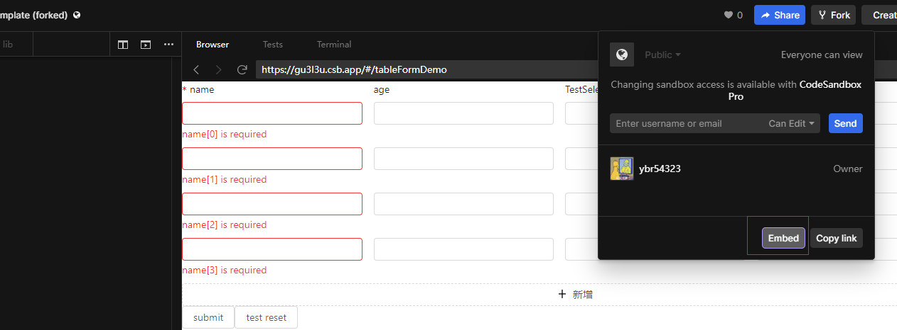
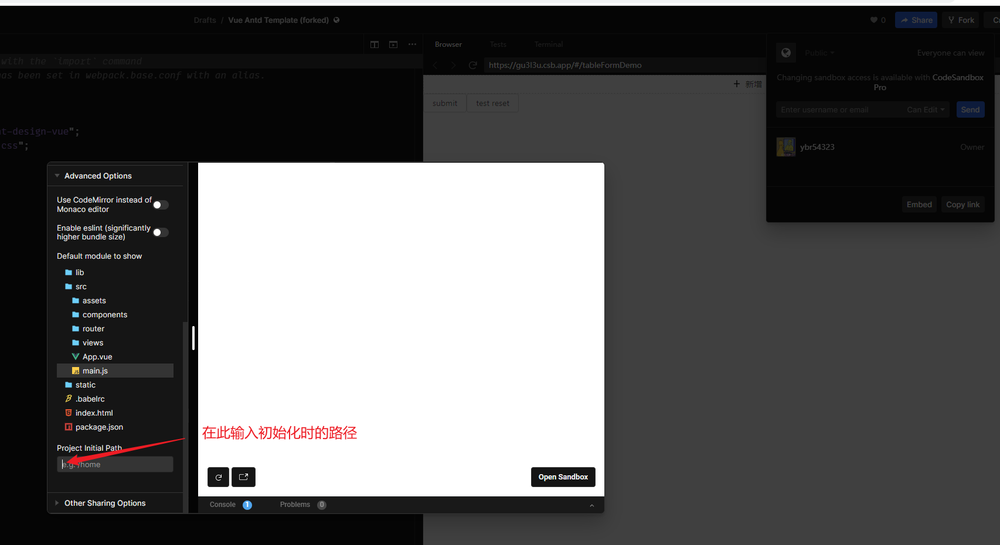

### @vue/test-utils使用记录
#### 如何给测试用例中的全局Vue设置组件(`use()`),并使其生效 
例子:
```js
import antv from 'ant-design-vue'
import { shallowMount, createLocalVue } from '@vue/test-utils'

const localVue = createLocalVue()
localVue.use(antv)

it('your test', () => {
    const wrapper = shallowMount(YourComponent, { localVue })
})
```
#### 如何调用组件的方法、如何使用`$nextTick`方法
```js
it('your test', async () => {
    const wrapper = shallowMount(YourComponent)
    // side effect
    await wrapper.vm.$nextTick()
})
```


### 关于插槽和插槽作用域

#### 当要使用到具名插槽和插槽作用域时，写法如下（测试调用了作用域的删除行的函数）

要用到插槽作用域时，要设置`mountOptions.scopedSlots`，文档地址：https://v1.test-utils.vuejs.org/zh/api/options.html#scopedslots

```js
it("验证removeSlot有效", async () => {
    const wrapper = mount(TableForm, {
      localVue,
      propsData: { columns: [{ label: 'name', dataIndex: 'name', componentName: 'a-input' }] },
      scopedSlots: {
        removeSlot: `
        
        <template slot-scope="{ removeCallback }">
          <span class="remove-slot" @click="removeCallback">test-remove-slot</span>
        </template>
        `
      }
    });
    wrapper.vm.init({ list: [{ name: "a" }] });
    await wrapper.vm.$nextTick();
    const removeSlot = wrapper.find('.remove-slot')
    removeSlot.trigger("click")
    await wrapper.vm.$nextTick();
    expect(wrapper.findAll('.row').length).toBe(0)
});
```


### 如何在codesandbox中分享demo，并且设置打开时的路由




